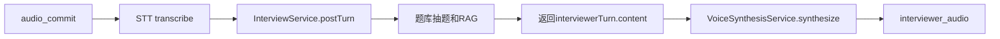

# 语音面试改为文本AI+纯TTS重构计划

## 目标

- 仅重构语音面试链路：`STT -> InterviewService(文本AI+题库+RAG) -> TTS`
- 不再让端到端语音模型负责“内容生成”
- 保留当前实时通道用于纯朗读（TTS）

## 现状关键点

- 语音链路当前在 [c:\Users\a1741\Desktop\外包\项目源码\AI-Interview\backend\src\main\java\com\daodun\websocket\InterviewWebSocketHandler.java](c:\Users\a1741\Desktop\外包\项目源码\AI-Interview\backend\src\main\java\com\daodun\websocket\InterviewWebSocketHandler.java) 中通过 `respondWithRealtimeInterviewer()` 拼 prompt 后直接 `pushTts(prompt)`，由火山端到端生成内容。
- 文本面试完整逻辑在 [c:\Users\a1741\Desktop\外包\项目源码\AI-Interview\backend\src\main\java\com\daodun\service\impl\InterviewServiceImpl.java](c:\Users\a1741\Desktop\外包\项目源码\AI-Interview\backend\src\main\java\com\daodun\service\impl\InterviewServiceImpl.java) 的 `postTurn` / `generateWelcomeStreaming`（包含题库抽题、RAG、追问决策、持久化）。
- TTS 输出在 [c:\Users\a1741\Desktop\外包\项目源码\AI-Interview\backend\src\main\java\com\daodun\service\impl\VoiceSynthesisServiceImpl.java](c:\Users\a1741\Desktop\外包\项目源码\AI-Interview\backend\src\main\java\com\daodun\service\impl\VoiceSynthesisServiceImpl.java)，可继续复用为“纯朗读器”。

## 重构方案

### 1) 改造语音会话主流程（核心）

在 [c:\Users\a1741\Desktop\外包\项目源码\AI-Interview\backend\src\main\java\com\daodun\websocket\InterviewWebSocketHandler.java](c:\Users\a1741\Desktop\外包\项目源码\AI-Interview\backend\src\main\java\com\daodun\websocket\InterviewWebSocketHandler.java)：

- `onPlayWelcome`：
  - 由当前 `respondWithRealtimeInterviewer(..., welcome=true)` 改为调用 `interviewService.generateWelcomeStreaming(userId, sessionId, delta -> {})`
  - 拿到完整开场白文本后调用 `pushTts(welcomeText)`
- `onAudioCommit`：
  - STT 得到 `transcript` 后，不再走 `respondWithRealtimeInterviewer` 的 prompt 拼接
  - 改为构造 `PostTurnRequest(content=transcript)` 调用 `interviewService.postTurn(userId, sessionId, request)`
  - 使用返回的 `interviewerTurn.content` 调用 `pushTts()`
- 保留 `user_transcript` 前端消息推送，保证 UI 行为不变

### 2) 删除/下线“端到端内容生成”入口

仍在同文件：

- 废弃 `respondWithRealtimeInterviewer()` 中“拼 prompt 让火山生成文本”的逻辑
- `interviewRounds`、`userSpeechHistory`、`buildRecentSpeechContext` 这类仅用于旧 prompt 的状态可移除（或先保留但不再参与决策，后续二次清理）

### 3) 异常与降级策略

- `InterviewService` 调用失败：
  - 返回 `error` 给前端（不吞异常）
  - 可增加一句简短兜底文本再 `pushTts`（可选）
- `pushTts` 失败保持现有行为：返回 `error` 或仅字幕，避免连接中断

### 4) 兼容性约束

- 本次按你要求保持 `text_answer` 不启用（语音链路 only）
- 现有前端 [c:\Users\a1741\Desktop\外包\项目源码\AI-Interview\frontend\src\views\InterviewView.vue](c:\Users\a1741\Desktop\外包\项目源码\AI-Interview\frontend\src\views\InterviewView.vue) 与 [c:\Users\a1741\Desktop\外包\项目源码\AI-Interview\frontend\src\services\voiceWebSocket.ts](c:\Users\a1741\Desktop\外包\项目源码\AI-Interview\frontend\src\services\voiceWebSocket.ts) 无需改协议

## 验证计划

- 开场白：进入面试后收到音频，内容来自 `generateWelcomeStreaming`
- 单轮问答：一次语音回答后，日志可见 `postTurn` 被调用，返回的面试官文本被朗读
- 题库行为：多轮对话出现 `next_question` 时由系统追加题目（不由语音 prompt 直接产题）
- RAG行为：在后端日志中出现文本面试同款检索链路（可按配置开关）
- 回归：前端仍能收到 `user_transcript` / `interviewer_audio` / `subtitle` 消息

## 涉及文件

- [c:\Users\a1741\Desktop\外包\项目源码\AI-Interview\backend\src\main\java\com\daodun\websocket\InterviewWebSocketHandler.java](c:\Users\a1741\Desktop\外包\项目源码\AI-Interview\backend\src\main\java\com\daodun\websocket\InterviewWebSocketHandler.java)
- [c:\Users\a1741\Desktop\外包\项目源码\AI-Interview\backend\src\main\java\com\daodun\service\impl\InterviewServiceImpl.java](c:\Users\a1741\Desktop\外包\项目源码\AI-Interview\backend\src\main\java\com\daodun\service\impl\InterviewServiceImpl.java)（本次主要复用，通常无需改）
- [c:\Users\a1741\Desktop\外包\项目源码\AI-Interview\backend\src\main\java\com\daodun\service\impl\VoiceSynthesisServiceImpl.java](c:\Users\a1741\Desktop\外包\项目源码\AI-Interview\backend\src\main\java\com\daodun\service\impl\VoiceSynthesisServiceImpl.java)（继续复用，无需替换实现）

