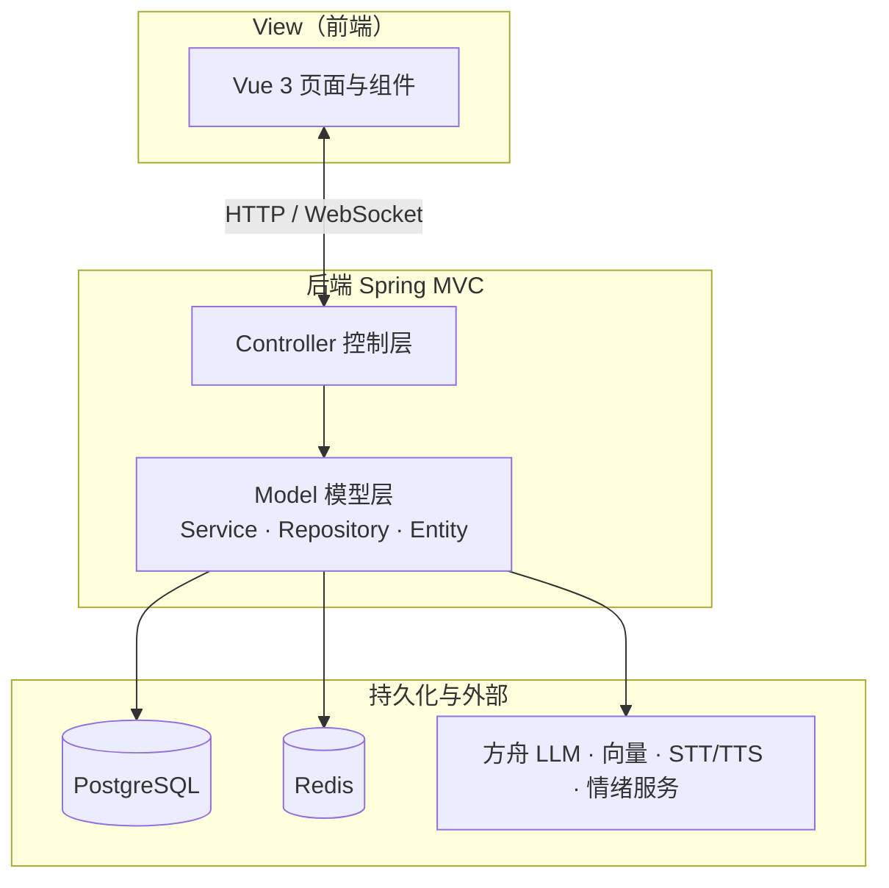

# 前后端分离架构示意图（MVC）

> **前后端分离**：浏览器端负责**界面（View）**；服务端采用 **Spring MVC** 思想——**Controller** 接请求，**Model** 承载业务与数据；**无服务端页面模板**，对外表现为 **JSON / WebSocket 消息**。

## 整体 MVC 关系（线框）

```
                              request（HTTP / WebSocket）
         ┌────────────────────────────────────────────────────────────────────────┐
         │  View（视图层）· 前端                                                     │
         │  Vue 3：页面、组件、交互；通过 axios / WebSocket 客户端发起请求              │
         └───────────────────────────────────┬──────────────────────────────────────┘
                                             │
                                             ▼
         ┌────────────────────────────────────────────────────────────────────────┐
         │  Controller（控制层）· 后端                                              │
         │  @RestController / WebSocket Handler：路由、参数校验、JWT 鉴权、返回 DTO   │
         │  例：/api/auth/* · /api/interview/* · /api/resume/* · /api/knowledge/*     │
         │       /ws/interview · /api/forum/* …                                       │
         └───────────────────────────────────┬──────────────────────────────────────┘
                                             │
                                             ▼
         ┌────────────────────────────────────────────────────────────────────────┐
         │  Model（模型层）· 后端                                                    │
         │  Service：业务编排（面试会话、评估、认证、简历、知识库…）                  │
         │  Repository + Entity：持久化与领域对象                                   │
         │  外部模型与服务：方舟 LLM、向量嵌入、火山 STT/TTS、情绪识别 HTTP 等          │
         └───────────────────────────────────┬──────────────────────────────────────┘
                                             │
                    ┌────────────────────────┼────────────────────────┐
                    ▼                        ▼                        ▼
            ┌──────────────┐         ┌──────────────┐         ┌──────────────┐
            │ PostgreSQL   │         │ Redis        │         │ 外部 API     │
            │ 业务与向量    │         │ 验证码等      │         │ LLM/语音/情绪 │
            └──────────────┘         └──────────────┘         └──────────────┘

                              response（JSON / 音频流 / WS 消息）→ View 渲染或播放
```

## MVC 职责说明

| 层次 | 位置 | 职责 |
|------|------|------|
| **V View** | 前端 `frontend/` | 用户可见界面；路由与组件状态；**不**直接访问数据库，只调后端接口。 |
| **C Controller** | 后端 `controller` / `websocket` | 接收请求、鉴权、参数校验；调用 Service；组装统一响应。 |
| **M Model** | 后端 `service`、`repository`、`entity` 及外部调用 | 业务规则、事务、持久化；调用 LLM、RAG、语音、情绪等**模型或外部能力**。 |

**说明**：经典 MVC 中「服务端 View」常为 JSP/模板；本项目为 **前后端分离 + REST**，服务端 **没有 HTML 视图**，**View 仅在前端**；后端 **Controller → Model → 持久化/外部服务** 仍完整对应 MVC 的分层思想。

## 数据流（MVC 视角）

1. **View**：用户操作触发路由或组件逻辑，发出 **request**。  
2. **Controller**：解析路径与 Body，校验 JWT，调用对应 **Service**。  
3. **Model**：Service 执行业务，经 **Repository** 读写 **PostgreSQL / Redis**，必要时调用 **方舟 LLM、向量、STT/TTS、情绪服务**。  
4. **Controller** 将结果封装为 **response** 返回 **View**。  
5. **View** 更新界面或播放语音。

## 与参考图（Flask / blueprint）的对应关系

| 参考图概念 | 本项目 MVC 对应 |
|-----------|------------------|
| 客户端 | **View（Vue）** |
| blueprint 路由 | **Controller** 中 `@RequestMapping` 等分组 |
| 后端内部 models | **Model**（Service + 实体 + 外部模型调用） |
| database | **Model** 通过 Repository 访问的 PostgreSQL；Redis 同由 Model 层使用 |

---

## Mermaid 版（MVC）


